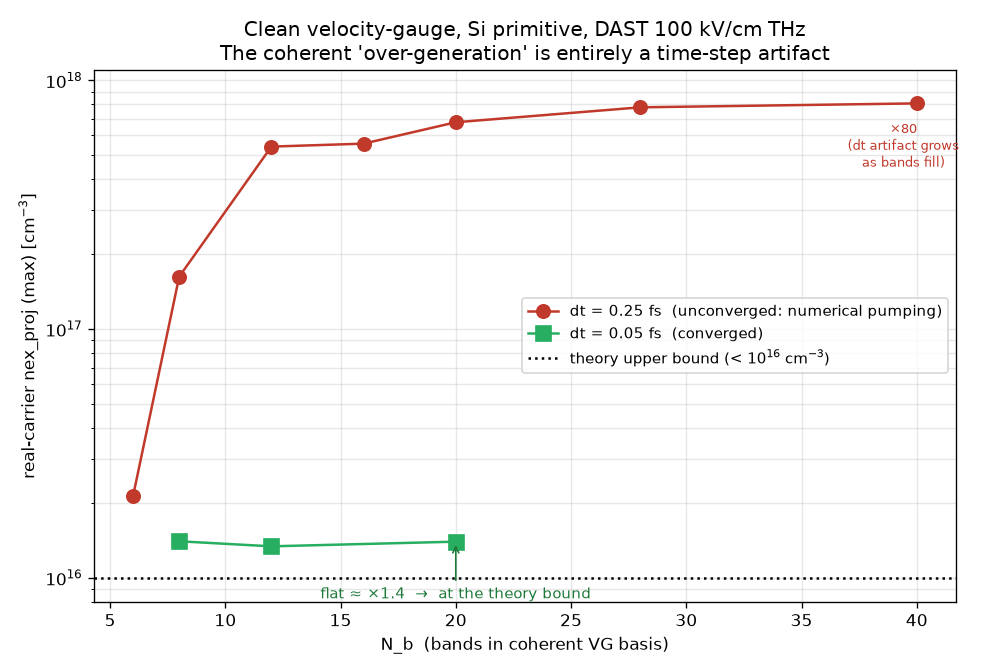
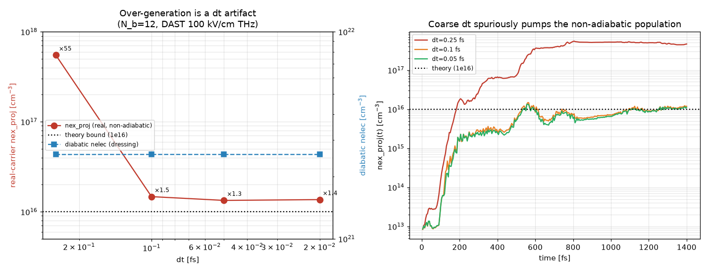
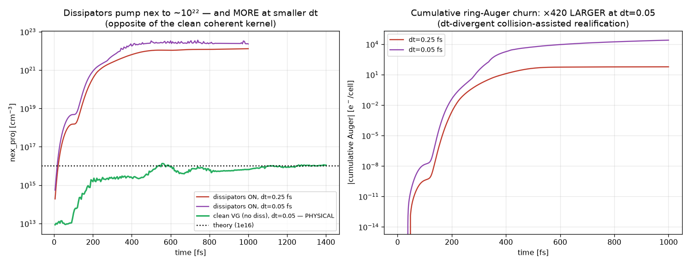

# VG Basis Sufficiency & N_b Convergence

Standalone specification for checking that the number of bands carried into the velocity-gauge (VG) dynamics is sufficient. This is a **separate** correctness axis from the plane-wave cutoff and is **not** fixed by rotating into the Houston basis. Belongs in the long-term reference because the band budget must be re-verified for every new material and every new driver wavelength.

> **⚠️ Read §6 first (measured, 2026-07-23).** At sub-gap THz the real-carrier "over-generation" is a **time-step artifact**, not a band-count problem: with `dt` converged (≤ 0.05 fs for Si) the clean VG reproduces the < 10¹⁶ theory bound and is **flat from N_b ≈ 8**. Always converge `dt` on the **non-adiabatic** measure (`nex_proj`/`nex_dref`) before running an N_b study — an unconverged `dt` fakes a basis-insufficiency.

> **Implementation in this fork.**
> - Primitives (pure, unit-tested): `vg_eta_admixture`, `vg_trunc_shift2`, `vg_conv_error`, `vg_ptop_exceeds` in [`../src/ssbe/sbe_superres_ssbe.f90`](../src/ssbe/sbe_superres_ssbe.f90).
> - Test: [`../tests/test_vg_basis_nb.f90`](../tests/test_vg_basis_nb.f90) verifies the three criteria plus the Hylleraas-Undheim-MacDonald interlacing/upper-bound theorem and the 2nd-order truncation-shift formula (with a self-contained Jacobi eigensolver — no LAPACK).
> - Runtime hook (criterion (a)): the real-time solver computes `P_top = max_k ρ̃_{N_b,N_b}(k,t)` at the `out_projection_k_step` cadence and, if it exceeds `1e-3`, writes a WARNING to the **error channel** and **continues** the run (`src/ssbe/realtime_ssbe.f90`). Criteria (b)/(c) are operator procedures (run two N_b; a priori η estimate), not automated.

---

## 1. Two independent truncations (the core point)

There are two distinct cutoffs; conflating them is the trap.

**(A) Plane-wave truncation N_PW (the EPM cutoff, e.g. 11 Ry).** Sets the accuracy of the EPM bands E_n(k) and Bloch functions |u_nk> themselves. Static, diagonalized once. 11 Ry for GaAs (~59 G-vectors/spin) converges the low conduction and valence bands to ~meV. Not the subject of this test.

**(B) Band-count truncation N_b carried into the dynamics (e.g. 32 spinor bands).** The density matrix rho(k) is 2N_b x 2N_b, and the VG Hamiltonian

> H_VG = H_0(k) + A(t) * pi,   pi_mn = <m|p|n>

couples bands through the interband momentum matrix element pi_mn. The field admixes high bands into low ones. Truncating at N_b discards the couplings pi_{m,N_b+1}, pi_{m,N_b+2}, ... — and **no subsequent diagonalization of H_VG in the Houston basis can restore those discarded columns.** This test targets (B).

---

## 2. Why the Houston basis does NOT cure an insufficient N_b

The Houston (adiabatic) basis is U(t) from diagonalizing the **truncated** VG Hamiltonian H_VG^(N_b) = P_{N_b} H_VG P_{N_b}, where P_{N_b} projects onto the retained N_b bands:

> H_VG^(N_b) U = U diag(eps_a),   eps_a = eps_a[ P_{N_b} H_VG P_{N_b} ].

These are eigenvalues of the **projected** operator. By the Hylleraas-Undheim-MacDonald variational/interlacing theorem, the truncated eps_a are upper bounds to the true levels, and the truncation error of level a is

> delta eps_a = Sum_{c > N_b} |<a| A pi |c>|^2 / (eps_a - eps_c) + O(A^4)
>             = Sum_{c > N_b} A^2 |pi_ac|^2 / (eps_a - eps_c) + ...

So the Houston basis **inherits** the error of the truncated VG Hamiltonian — it diagonalizes an already-corrupted matrix. Changing representation (Bloch -> adiabatic) changes neither the retained subspace nor the discarded coupling. The missing band space is absent in both representations.

**What an insufficient N_b corrupts, concretely:**
- adiabatic energies eps_a(k,t) -> shifts the impact-ionization gate eps_kin = E_h(k+A) - E_CBM and all energy bins;
- group velocities V_a = (U^dag pi U)_aa + A -> distorts X_a and the Kuhn-Zurek dephasing;
- current j = Tr[(pi + A) rho] -> distorts the HHG spectrum, most sensitively the high harmonics (which live on the high bands). The HHG plateau cuts off where bands run out — the high-harmonic spectrum is the most sensitive indicator.

---

## 3. Three convergence criteria (increasing rigor)

### Criterion (a): top-band occupation P_top — cheapest, run every production job
Track the adiabatic population of the highest retained band:

> P_top(t) = max_k rho~_{N_b,N_b}(k,t)   (rho~ = U^dag rho U)

Practical threshold: **P_top < 1e-3** at all times. If P_top reaches ~1e-4 to 1e-3, the field is pushing population to the basis edge -> bands above the cutoff would also have been populated -> enlarge N_b. Necessary condition: a populated top band means the discarded bands above it mattered. *(Automated here: a WARNING on the error channel; the run continues.)*

### Criterion (b): N_b convergence study — the gold standard
Run with N_b and N_b + Delta (e.g. 32 and 48) and compare an observable O (current, HHG spectrum, carrier number):

> eps_conv = || O_{N_b+Delta} - O_{N_b} || / || O_{N_b+Delta} ||

Band-count convergence is the only rigorous check. For HHG, compare the spectrum **on a log scale up to the harmonic order of interest** — the plateau must coincide. This is mandatory validation, not optional.

### Criterion (c): adiabatic admixture parameter eta — a priori estimate
Dimensionless strength of admixing the first discarded band:

> eta_ac = A_max |pi_ac| / |eps_a - eps_c|

The basis is sufficient for level a if eta_{a,N_b} << 1 for the coupling to the **first discarded** band. When eta >~ 1 perturbation theory fails, admixture is nonperturbative, and the band cannot be discarded. This is the bridge to the field estimates below.

---

## 4. Worked field estimate: 1 MV/cm THz (GaAs)

**Field and A_max.** E_0 = 1 MV/cm = 1e8 V/m. With E_a.u. = 5.142e11 V/m:
> E_0 = 1e8 / 5.142e11 = 1.945e-4 a.u.

For a monochromatic drive A_max = E_0/omega. Chefonov THz, f = 1.5 THz:
> hbar*omega = 2 pi hbar f = 6.2e-3 eV = 2.28e-4 a.u.
> A_max = E_0/omega = 1.945e-4 / 2.28e-4 = 0.85 a.u.

**This A_max is of order the Brillouin-zone size.** GaAs 2pi/a = 2pi/10.68 = 0.588 a.u., so
> A_max / (2pi/a) ~ 0.85 / 0.588 ~ 1.45

— the field sweeps the electron across **more than a full BZ** per half cycle. This is why the adiabatic/Houston language is mandatory; but the band budget still must be checked.

**Per-level admixture.** GaAs interband momentum element from Kane's E_P = 2|pi_cv|^2/m ~ 25.7 eV -> |pi_cv| ~ 0.97 a.u. Characteristic interband coupling energy:
> A_max |pi_cv| ~ 0.85 * 0.97 ~ 0.82 a.u. = 22.4 eV.

Compare to gaps:
- **Low bands (gap, lowest conduction), gaps ~1-3 eV:** eta = 22.4/2 ~ 11 >> 1 -> strongly nonperturbative admixture. This does NOT mean "basis too small" — it means the lowest ~10-15 bands are strongly mixed and must ALL be retained (as they are). The adiabatic basis diagonalizes them correctly **if they are in the basis**.
- **Basis edge (N_b = 32 -> 16 orbital bands):** the 16th GaAs band sits ~20-30 eV above the valence-band top. The naive A_max|pi| ~ 22 eV looks alarming, but the **formal perturbative estimate is useless here because everything is nonperturbative**. Real band occupation is cut off **energetically**: the populated region extends to eps_kin ~ a few eV above CBM (Chefonov: "up to several eV"), not to 22 eV, because the oscillating THz field returns the packet.

**THz-specific regime caveat.** At hbar*omega = 6 meV << gap 1.42 eV the Keldysh parameter gamma_K = omega sqrt(2 m E_g)/(e E_0) is small -> **tunneling / quasi-static regime**. High-band admixture is then predominantly **virtual** (adiabatic following); real interband population is exponentially suppressed by the Zener factor. So despite A_max ~ 1.45 x BZ, the number of **really populated** bands is modest, and **N_b = 32 (16 orbital) is likely converged with margin for 1 MV/cm THz** — but this must be **confirmed** by a 32-vs-48 run, not assumed.

**Bottom line for 1 MV/cm THz:** the formal-perturbative estimate is uninformative (all nonperturbative); the only reliable criteria are **(b) N_b convergence + (a) P_top monitoring**. Physically the eps_kin ~ 5 eV cap corresponds to roughly GaAs bands #10-14 above the valence top, so 32 spinor bands should have headroom — verify, do not assume. For shorter-wavelength drivers (IR/visible: A_max = E_0/omega is smaller at fixed E_0, but the photon is larger and the energy reach is higher) the band budget must be re-checked separately.

---

## 5. Procedure (what to actually do)

1. **Every production run:** log P_top(t) = max_k rho~_{N_b,N_b}(k,t). Flag if it exceeds 1e-3. *(Done automatically: a warning on the error channel, run continues.)*
2. **Once per (material, driver) setup:** run N_b vs N_b+16 (e.g. 32 vs 48), compute eps_conv on the current/HHG spectrum/carrier number; require the HHG plateau to coincide on a log scale to the harmonic order of interest. Treat a failed match as "increase N_b and repeat."
3. **A priori sizing:** estimate eta_{a,N_b} = A_max |pi| / gap-to-first-discarded-band; if >~ 1 near the top of the energetically populated region, add bands before running.
4. **Re-verify on any change** of material or driver wavelength — the converged N_b does not transfer.

---

## 6. MEASURED CASE STUDY — the sub-gap-THz "over-generation" is a **dt artifact**, not a band-count problem (2026-07-23)

A clean-velocity-gauge convergence study on **Si primitive, driven by the maintainer's
DAST optical-rectification THz transient** (peak E ≈ 100 kV/cm, 3.3 THz, Keldysh
γ_K ≈ 5.7 — deep sub-gap, where theory expects real carriers **< 10¹⁶ cm⁻³**),
`5×5×5`, no dissipation. This settled a live puzzle: the frozen-window VG appeared to
over-generate real carriers by ~10³ at this working point. **It does not — the coherent
kernel reproduces the theory bound once `dt` is converged.**

**Method note.** The intended knob `nstate_sbe < nstate` for shrinking the coherent basis
is **currently broken** (heap overflow: `dt_evolve_bloch_cf4` copies the `(nstate,nstate)`
`gs%p_tm_matrix` into a `(nstate_sbe,nstate_sbe)` buffer — see the decisions log). So each
N_b point here is a **separate ground state** regenerated at that band count (the EPM's
lowest-N_b eigenpairs are truncation-invariant, so this is exactly criterion (b)).

### (i) N_b convergence is meaningless at an unconverged dt

At **dt = 0.25 fs** the non-adiabatic real-carrier density `nex_proj` **climbs** with N_b
(×2 → ×80 theory) and "converges" to a **wrong, dt-inflated** value — the classic symptom
that would send you to add ever more bands (the §4 THz worry). At **dt = 0.05 fs** it is
**flat from N_b ≈ 8** (×1.4) — the added bands are not needed. The dt-error was filling
each newly-available band, *faking* a basis-insufficiency.

### (ii) Refine dt at fixed N_b: the real measure collapses, the dressing does not

| dt [fs] | `nex_proj` (real, non-adiabatic) | × theory | diabatic `nelec` (dressing) |
|---|---|---|---|
| 0.25 | 5.5×10¹⁷ | **55** | 2.554×10²¹ |
| 0.10 | 1.5×10¹⁶ | 1.5 | 2.556×10²¹ |
| 0.05 | 1.3×10¹⁶ | 1.3 | 2.555×10²¹ |
| 0.02 | 1.4×10¹⁶ | 1.4 | 2.555×10²¹ |

`nex_proj` falls **×40** and converges to ≈ 1.3–1.4×10¹⁶ ≈ the theory bound (residual ×1.3
is the coarse `5³` grid / finite N_b / genuine small multiphoton). The **diabatic `nelec`
is dt-flat to 4 digits** — it is the reversible A²(t) dressing (~2.5×10²¹), 700× larger and
dt-insensitive. The right panel shows the mechanism: at dt = 0.25 the spurious population
**accumulates over the pulse**; at dt ≤ 0.1 it tracks the theory bound.

### Three lessons (add to the criteria in §3)

1. **Judge convergence on the non-adiabatic real-carrier measure** (`nex_proj`/`nex_dref`
   in `_sbe_nex_nonad.data`), **never on the diabatic `nelec`/`nhole`** — the latter is
   dominated by the reversible dressing and is dt-flat, so it will falsely certify
   "dt-converged" while the real excitation is off by ×40.
2. **Criterion (b) N_b-convergence MUST be run at a converged `dt` first.** An
   under-resolved `dt` pumps the non-adiabatic sector into every band you add, so `nex`
   rises with N_b and mimics a band-budget problem. Converge `dt` on the real-carrier
   measure, *then* converge N_b.
3. **Time-step for the real measure:** for Si's ~14 eV band spread use **`dt ≤ 0.05 fs`**
   (`0.1` is ~10 % high; `0.25` is ×40). The CF4 stays **unitary** — electrons = 8.000 at
   every `dt` — so the failure is invisible in the trace and in the diabatic density; it is
   a phase-accuracy failure of the fast interband coherences (5.3 rad/step at dt = 0.25 fs
   × 14 eV). This is a *separate* axis from `dt` for the absorbed **energy** (wiki/11 §3c).

> **Reproduce:** `samples/exercise_x08_Si_primitive_hhg_basis` GS at several `nstate`, clean
> `&sbe`, a sub-gap THz field, and scan `dt` — read `_sbe_nex_nonad.data` col 2/3, not
> `_sbe_nex.data`.

### (iv) With dissipators ON, the over-generation is a SEPARATE, dt-DIVERGENT pathology

The clean-kernel `dt` cure above does **not** carry over to the dissipative run — the
opposite is true. Same field/material, `4³`, `nstate=16`, frozen window, full ring
(e-ph + acoustic + II + Auger), to 1000 fs:

| `dt` [fs] | `nex_proj` (diss ON) | cumulative ring-Auger [e⁻/cell] |
|---|---|---|
| 0.25 | 1.3×10²² (×10⁶) | −59 |
| 0.05 | 3.6×10²² (×10⁶) | **−24 900** |

The green curve is the **clean VG at the same dt=0.05** (~10¹⁶ = physical). Turning the
dissipators on pumps `nex_proj` to **~10²² at any `dt`, and refining `dt` makes it worse**
(nex ~×2, Auger churn **×420**); electrons = 8.000 throughout (trace is conserved — this is
*not* a trace leak). **Mechanism:** the ring/frozen-sector CP-decoherence realifies the
reversible A²(t) dressing **per scattering event** (wiki/00, the "collision-assisted
generation" note), and that per-step realification is **not rate-normalized (∝ dt)** — so
more steps (smaller `dt`) ⇒ more spurious real carriers ⇒ more Auger (∝ n²).

**Consequence.** Two independent over-generation layers with *opposite* `dt` behaviour:
the **coherent** one is cured by `dt ≤ 0.05 fs`; the **dissipative** one is a separate bug
that `dt` cannot fix (it worsens it). The real fix must exclude the reversible dressing from
the collision source (the Option-A direction, `yn_sbe_dressed_ref`) **and/or** rate-normalize
the per-step realification so the ledger converges as `dt → 0`. Until then, sub-gap dissipative
absolute yields are unreliable regardless of `dt` — see the wiki/04 flag box.

---

## 7. Band budget by field strength (1 MV/cm and above)

Two independent reasons a stronger field needs more `nstate`, and both now bite
the **same** knob because the dressed projection is full-basis (`yn_sbe_full_dressed`):

1. **VG unitary sufficiency** (§2–3): the field shifts `k → k + A(t)`; the excursion
   is `A_max / (2π/a)` of the BZ. Population must not reach the top band (`P_top`).
2. **Dressed projection** (§6): the dissipators/measure diagonalise H_VG — with the
   fix that uses **all `nstate` bands**, so `nstate` must also span the states the
   field actually dresses. A too-small `nstate` now over-generates at the source,
   not just at the readout.

**The excursion scales linearly with E** (single-cycle THz: read `A_max` off the
field file directly). For the Si primitive (`2π/a = 0.612 a.u.`) driven by the
DAST 3.3 THz transient, scaling the measured `A_max = 0.070 a.u.` (at ~100 kV/cm):

| peak E | `A_max/BZ` | regime | γ_K (Si, E_g 3.34 eV) | **start `nstate`** (Si, 4 val) |
|---|---|---|---|---|
| ~100 kV/cm | 0.12 | perturbative, sub-cycle | ≈ 6 | 16–20 (x08 headroom) |
| **1 MV/cm** | **1.15** | sweeps a **full BZ**/half-cycle; ε_kin ~ few eV [Chefonov] | ≈ 0.6 (tunnelling onset) | **24–32** |
| 3 MV/cm | 3.4 | multi-BZ, hot tail toward X | < 0.3 (tunnelling) | 40–48 |
| ≥ 10 MV/cm | ≥ 11 | strongly non-perturbative | ≪ 1 | 48–64+, re-verify hard |

These are **starting points, not converged values** — always confirm with the
procedure below. The numbers assume a THz driver (large `A_max = E/ω`); a mid-IR/
optical driver at the same E has a **smaller** `A_max` (higher ω) but reaches
**higher energy** per photon, so the band budget must be re-checked separately (§3).

**Procedure at high field (mandatory):**
1. **Converge `dt` first** (§6 lesson): on the **non-adiabatic** measure
   (`nex_proj`/`nex_dref`), never the diabatic `nelec`. At γ_K ≲ 1 the coherences
   are faster — expect `dt ≤ 0.02–0.05 fs` (tighter than the ~0.05 fs of the weak
   field; `wiki/11 §3c`).
2. **`P_top < 1e-3`** at all times (criterion a). At 1 MV/cm+ the warning fires
   readily — raise `nstate` until it clears.
3. **`nstate` convergence at the converged `dt`** (criterion b): run e.g. 24/32/48,
   require `nex_proj` to plateau (§6 shows it is *flat from N_b ≈ 8 only at weak
   field*; a strong field needs many more before the plateau).
4. Keep `yn_sbe_full_dressed = 'y'` — a narrowed frozen window truncates the
   projection and re-introduces the over-generation exactly where the strong field
   populates the high bands.

**Cost note:** with the full-basis projection the ring scales `O(nk²·nstate²)`, so
doubling `nstate` for a strong field is ~4× on the ring (`wiki/11 §3d`). Budget the
grid/`dt`/channel set accordingly, or use the cost-preserving variant when it lands.

---

## 8. References
- Variational upper-bound / interlacing of truncated eigenvalues: E. A. Hylleraas & B. Undheim, Z. Phys. 65, 759 (1930); J. K. L. MacDonald, Phys. Rev. 43, 830 (1933).
- Velocity-gauge band-coupling and the need for many bands / gauge care: M. S. Wismer & V. S. Yakovlev, Phys. Rev. B 97, 144302 (2018); L. Yue & M. B. Gaarde, J. Opt. Soc. Am. B 39, 535 (2022).
- Kane momentum matrix element / E_P for GaAs: E. O. Kane, J. Phys. Chem. Solids 1, 249 (1957); E_P ~ 25.7 eV, I. Vurgaftman, J. R. Meyer, L. R. Ram-Mohan, J. Appl. Phys. 89, 5815 (2001).
- Keldysh parameter / tunneling-vs-multiphoton crossover: L. V. Keldysh, Sov. Phys. JETP 20, 1307 (1965).
- THz carrier energies reaching several eV in n-Si (populated-band reach): O. V. Chefonov et al., Phys. Rev. B 98, 165206 (2018).
