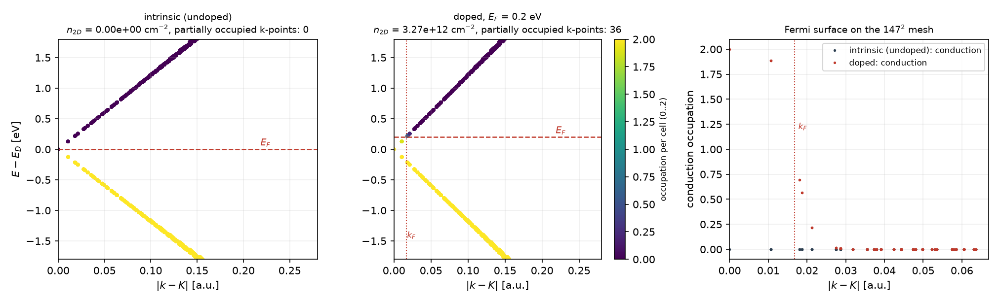
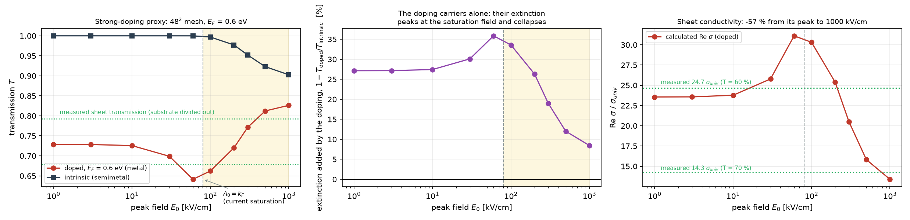
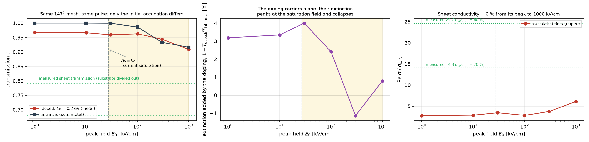

# Graphene sheet solver: gapless-cone dissipation with collisional memory, a two-temperature Coulomb sector, and a self-consistent sheet field

**Status: implemented and unit-tested (2026-09-04); calc-validation in exercise x14. Maintained together with `wiki/10` §8.11.**
*Written in the form of a methods paper so that it can be lifted into a manuscript; every equation is the one the code evaluates, every constant is cited, every claim carries its test.*

---

## Abstract

We describe the graphene branch of the SALMON2-TROUT semiconductor-Bloch-equation (SBE) solver, built to study field-induced transparency / absorption of a monolayer graphene sheet under 1–100 kV/cm single-cycle THz transients (the maintainer's DAST source) and near-infrared pulses. Three elements were added to the general velocity-gauge, completely-positive (GKLS) SBE machinery: (i) a **collisional-memory (non-Markovian) treatment of the ring dissipators adapted to the gapless Dirac cone** — the electron–phonon sectors keep their phonon-line kernels while the Coulomb (Auger / carrier-multiplication) sector, which on the cone is a *global* rate model, receives the 2D Dirac-plasmon line of the instantaneous electron–hole plasma as its memory kernel; (ii) a **two-temperature description of the Coulomb sector**, in which a carrier temperature $T_e$ and the quasi-Fermi levels are read from the first two moments of the gathered Dirac-cone populations while the lattice stays at the phonon-bath temperature and cools the carriers through the phonon channel; (iii) a **self-consistent sheet field** (radiation reaction) in the single-cell driver, so that the total field written by the solver *is* the transmitted field and the transmission coefficient follows from the field before and after the sheet; and (iv) a **doped / finite-temperature initial occupation**, which turns the intrinsic semimetal into the metal a real sample is and gives it a Drude sector, with the velocity-gauge pure-gauge reference kept undoped so that the physical intraband current survives the correction of point (v). A further element turned out to be indispensable at THz (v): a **parameter-free pure-gauge restoration of the velocity-gauge current** — a truncated basis cancels only part of the diamagnetic current of the filled π band (70 % for two bands), the remainder, proportional to $A=E/\omega$, turns the sheet into a plasma mirror, and the fitted linear correction first tried over-corrects at high field and makes the self-consistent sheet unstable; subtracting the adiabatic ground-state current of the same truncated Hamiltonian removes the artifact exactly at every field with no adjustable quantity (§6a). We give the equations, the numerical realization, the cost scaling ($O(N_k^2)$ for the graphene ring), the k-mesh rules (resonance-shell resolution; Dirac point on the half-shifted Monkhorst–Pack mesh only for odd multiples of 3; Zener excursion $A_0$ versus mesh spacing), the unit tests that pin each piece, and the calculation-level validations. A level check performed on the way exposed and removed a spurious 0.21 eV gap at the Dirac point of the previously used 7-plane-wave empirical pseudopotential basis.

---

## 1. Scope and notation

Monolayer graphene is represented by the π/π* pair of the Ramanujam local empirical pseudopotential (EPM) in the 2-atom hexagonal primitive cell embedded in a 20 Å vacuum slab (strictly two-dimensional plane-wave basis, no $G_z$ components and no dispersion along $z$: an isolated sheet, not graphite); the SBE runs on `nstate = 2` bands (the pure-gauge restoration of §6a makes the result independent of `nstate`). Hartree atomic units are used throughout ($e=\hbar=m_e=1$, $c = 137.036$); the sheet lies in the $xy$ plane, the driving field is in-plane. $N_k$ denotes the number of k-points of the $N\times N\times1$ Monkhorst–Pack (MP) mesh; $A_{2D}=(\sqrt3/2)a^2$ is the primitive-cell area, $L_z$ the slab height along the vacuum axis, so the cell volume is $V=A_{2D}L_z$.

The ground-state basis is the shell-complete set $|\mathbf G|^2\le 29.4$ a.u. (43 plane waves). The earlier 7-plane-wave set ($|\mathbf G|^2\le 2.94$) is **not closed under the little group $C_{3v}$ of K** (the rotation about K maps a first-shell vector onto the second-shell vector $\mathbf b_2-\mathbf b_1$ absent from the set); the symmetry protection of the Dirac degeneracy is then lost and a spurious gap of 0.2125 eV opens at K (identical in the Python reference and in the Fortran band path). With 43 plane waves the gap is $<10^{-5}$ eV, $v_F = 0.960\times10^6$ m/s, and the Γ-bottom / M-dip values fall inside the thesis acceptance windows (`tests/test_graphene_dirac_levels.py`).

## 2. Master equation and channels

The density matrix $\rho_{\mathbf k}(t)$ obeys the velocity-gauge SBE in GKLS form,
$$
\dot\rho_{\mathbf k} = -i\,[H_{\mathbf k}(t),\rho_{\mathbf k}] + \sum_c \mathcal D_c[\rho],\qquad
H_{\mathbf k}(t) = \varepsilon_{\mathbf k} + \mathbf A(t)\cdot\boldsymbol\pi_{\mathbf k} + \tfrac12 A^2,
$$
propagated with the fourth-order commutator-free Magnus (CF4) scheme in Strang splitting with the dissipators $\mathcal D_c$, which act in the instantaneous Houston (field-dressed) basis of $H_{\mathbf k}(t)$ (`wiki/03`, `wiki/08`). On graphene the "ring" (inter-k) channels are:

* **electron–phonon**, the two Kohn-anomaly optical modes $E_{2g}$ (Γ, 196 meV) and $A_1'$ (K, 160 meV) with $\langle g^2_\Gamma\rangle=0.0405$, $\langle g^2_K\rangle=0.0994$ eV² and the GW factor 2 on the K mode [1,2], plus the quasi-elastic acoustic deformation-potential mode ($D=16$ eV, $v_{ph}=2\times10^6$ cm/s [3], grid-resolved $q$, Thomas–Fermi screened);
* **Coulomb (Auger recombination / carrier multiplication)**, the Rana rate model [4]: CCCV/CVVV recombination $R$ and their CVCC/VCCC time-reverses $G$ evaluated on the instantaneous quasi-Fermi levels of the gathered sheet densities $n$, $p$, applied as a uniform-fractional, trace-exact, bounded population transfer $R-G$. Impact ionization with a gap threshold, the carrier–carrier Fermi–Dirac fit and Kuhn–Zurek dephasing are not defined on a gapless cone and are refused by the code.

The Coulomb balance $R=G$ holds iff the electron and hole quasi-Fermi levels coincide; for a symmetric pair population this is $\mu=0$, i.e. the intrinsic density of the cone at the temperature $T$ the rates are evaluated at,
$$
n_0(T)=n_i(T)=\frac{\pi}{6}\left(\frac{k_BT}{\hbar v_F}\right)^2 \;=\; 8.08\times10^{10}\ \mathrm{cm^{-2}}\ \text{at 300 K}. \tag{1}
$$
Below $n_i$ the plasma net-multiplies, above it net-recombines: the pair population saturates at $n_i(T)$ (`tests/test_rana_saturation.f90`: root of $R-G$ at $n_i$ to $10^{-4}$, two-sided monotone CPTP relaxation, $T^2$ law).

## 3. Collisional memory on the gapless cone (the "2D colmem analog")

### 3.1 Motivation
The Markovian ring dissipators scatter the reversible field-induced admixture of conduction character ("dressing") as if it were real population (`wiki/10` §1). For gapped materials this was cured in three sectors (§8.7–8.10 of `wiki/10`): a memory kernel in the coherence damping, a memory filter on the populations that feed the collision kernels, and a dressed reference for the carrier measure. Graphene had been excluded by a guard. Two features of the cone required a dedicated version: its population channel is the **Coulomb rate model on the global densities $n,p$**, so the virtual share inflates the very quantities the R07 rates are evaluated on; and the memory line of a Coulomb collision is not a phonon energy but the **plasma response** — screening builds up on the inverse plasma frequency [5].

### 3.2 Kernels
All memory filters have the form used in `wiki/10` §8.6–8.9: a set of Lorentzian lines $\{c_j,\mu_j\}$, $\mu_j = 1/\tau_c \pm i\omega_j$ with the thermal split $(N_j+1):N_j$, the common width $1/\tau_c=\sigma_E$ (the ring's energy-matching width), and the discrete Markov anchor $R(0)=1$, so that a constant quantity is a machine-exact fixed point (calibrated rates untouched) while a modulation at frequency $\omega$ is transmitted with $|R(\omega)|=|\sum_j c_j/(\mu_j+i\omega)|$.

| sector | line set |
|---|---|
| e-ph coherence damping (`yn_sbe_colmem`) | graphene phonon table: $E_{2g}$, $A_1'$, acoustic |
| e-ph population source (`yn_sbe_colmem_pop`) | same |
| **Coulomb source densities $n,p$** | **2D Dirac plasmon** $\omega_{pl}(n,p)$ at $q=Q_{TF}$ |

The long-wavelength plasmon of the Dirac gas [6], $\omega_{pl}^2(q)=2e^2E_Fq/(\kappa\hbar^2)$ (Gaussian units), is generalized to the two-component electron–hole plasma by adding the Drude weights, each branch's $E_F$ becoming the finite-temperature intraband Drude weight [7]
$$
W(\mu)=2k_BT\,\ln\!\big[2\cosh(\mu/2k_BT)\big]\;\to\;|\mu|\ (\text{degenerate}),\quad 2k_BT\ln2\ (\text{intrinsic}),
$$
and it is evaluated at the collision's own screening momentum, the Thomas–Fermi vector of R07 Eq. (13),
$$
\omega_{pl}^2=\frac{2\,[W(\mu_c)+W(\mu_h)]\,Q_{TF}}{\varepsilon_r},\qquad
Q_{TF}=\frac{4k_BT}{\varepsilon_r v_F^2}\ln\!\big[(e^{\mu_c/k_BT}+1)(e^{\mu_h/k_BT}+1)\big]. \tag{2}
$$
At 300 K and $\varepsilon_r=10$: $\hbar\omega_{pl}=31$ meV (intrinsic), 35 meV at $n=p=10^{11}$, 133 meV at $10^{12}$ cm⁻² — the phonon scale, all $\ll 2\hbar\omega_{\rm laser}$ for near-IR drives (`tests/test_colmem_2d.f90`: degenerate limit $\omega_{pl}^2=2E_FQ_{TF}/\varepsilon_r$ to $10^{-6}$; a $2\omega$ breathing at 0.8 eV transmitted at $0.17=|R(2\omega)|$). No new input variables and no new free parameters enter: $T$, $\varepsilon_r$ and the $\mu$'s are the Rana channel's own.

### 3.3 Composition
Per ring step: dressed-reference subtraction (basis level) → ring gate → the raw Coulomb source moments $(n,p,\varepsilon)$ are captured → the phonon-line filter replaces the gathered populations for the e-ph kernel → the Coulomb channel filters $n,p$ with the plasmon line and evaluates $R-G$ on them (`rana_auger_dpop(n2d_in,p2d_in)`), while its transfer stencils and the CPTP limiter still use the instantaneous populations. Trace is exact and positivity unchanged. Kuhn–Zurek dephasing remains forbidden on graphene (many-body coherence loss).

## 4. Two-temperature Coulomb sector

### 4.1 Model
The R07 rates are quasi-equilibrium expressions in $(\mu_c,\mu_h,T)$. Evaluating them at the lattice temperature under-estimates the balance density of a hot plasma by $(T_e/T_L)^2$ (Eq. 1). We therefore read a **common carrier temperature** from the gathered populations. With the Dirac-point energy $E_D$ (midpoint of the instantaneous band edges, exact by electron–hole symmetry), the moments per unit area are
$$
n=\frac1{N_kA_{2D}}\sum_{\mathbf k} f_{c\mathbf k},\quad
p=\frac1{N_kA_{2D}}\sum_{\mathbf k}(2-f_{v\mathbf k}),\quad
\varepsilon=\frac1{N_kA_{2D}}\Big[\sum_{\mathbf k} f_{c\mathbf k}(\epsilon_{c\mathbf k}-E_D)+\sum_{\mathbf k}(2-f_{v\mathbf k})(E_D-\epsilon_{v\mathbf k})\Big],
$$
and $(k_BT_e,\mu_c,\mu_h)$ solve
$$
n=n_D(\mu_c,T_e),\quad p=n_D(\mu_h,T_e),\quad \varepsilon=\varepsilon_D(\mu_c,T_e)+\varepsilon_D(\mu_h,T_e), \tag{3}
$$
$$
n_D(\mu,T)=\frac{g}{2\pi}\!\int_0^\infty\!k\,f\!\Big(\frac{v_Fk-\mu}{k_BT}\Big)dk,\qquad
\varepsilon_D(\mu,T)=\frac{g}{2\pi}\!\int_0^\infty\!k\,(v_Fk)\,f\!\Big(\frac{v_Fk-\mu}{k_BT}\Big)dk,\quad g=4,
$$
with the closed forms $n_D(0,T)=\frac{\pi}{6}(k_BT/v_F)^2$ and $\varepsilon_D(0,T)=\frac{2}{\pi}\cdot\frac{3\zeta(3)}{2}\,(k_BT)^3/v_F^2$. At fixed $(n,p)$ the energy is monotone in $T$, so Eq. (3) is solved by a bisection in $\ln T$ with the density inversions nested inside (`dirac_fit_te`). $T_e$ is clamped from below at the lattice temperature (carriers are not colder than the bath) and the fit falls back to the bath when there are no carriers.

### 4.2 Use
$k_BT_e$ replaces the bath temperature in every carrier-side quantity of the Coulomb sector: the R07 integrals, $Q_{TF}$, the plasmon line and its thermal split. The phonon Bose factors keep the lattice temperature. **No separate rate equation for $T_e$ is integrated**: heating by the field and cooling by optical/acoustic phonon emission are already contained in the SBE kinetics; the two-temperature model is realized by *reading* $T_e$ from the distribution at every ring step. The time series $(T_e,\mu_c,\mu_h,n,p,n_i(T_e))$ is written to `*_sbe_te.data`. Interpretation: for a hot, non-thermal photo-excited shell the fit returns an effective temperature at which the R07 channel *generates* pairs toward $n_i(T_e)$ — the carrier-multiplication regime of graphene [8,9] — and switches to recombination as phonon cooling lowers $T_e$.

Unit test `tests/test_dirac_te_fit.f90`: the closed form of $\varepsilon_D(0,T)$; explicit 2D-mesh moments of thermal populations reproduce $n_D,\varepsilon_D$ to $0.5\%$ and the fit recovers $T$ to $10^{-4}$ and $\mu$ to $10^{-4}k_BT$; the degenerate case $E_F=0.3$ eV at 300 K; fallbacks; monotonicity.

## 4a. The doped sheet: initial occupation, the Drude sector, and the field scales of transparency

### 4a.0 Choosing the doping: it is read off the measurement, not fitted
$E_F$ is a property of the sample, and a THz transmission measurement determines
it together with the momentum-relaxation time $\tau$. The chain is closed and has
no free parameter left over.

**Step 1 -- from the measured transmission to a sheet conductance.** A measurement
that has not had the substrate divided out contains the substrate's own Fresnel
loss. For a slab of index $n_s$ with two incoherent faces,
$$
T_{\rm bare}=\Big[\frac{4n_s}{(1+n_s)^2}\Big]^{2},\qquad
\frac{T_{\rm meas}}{T_{\rm bare}}=\Big[\frac{1+n_s}{1+n_s+Z_0\sigma}\Big]^{2}
\ \Longrightarrow\
Z_0\sigma=(1+n_s)\Big[\sqrt{T_{\rm bare}/T_{\rm meas}}-1\Big]. \tag{4a.1}
$$
PET, $n_s=1.65$: $T_{\rm bare}=0.883$, so $T_{\rm meas}=0.60\to\sigma=24.7\,\sigma_{\rm univ}$
and $0.70\to14.3\,\sigma_{\rm univ}$ (`drude_check.py --t-meas`, pinned in
`tests/test_doped_drude.py`). Use the *low-field* value: that is the linear
conductance the doping alone produces.

**Step 2 -- split $\sigma_{dc}=D\tau/\pi$ into $E_F$ and $\tau$.** One equation, two
unknowns; any one of three independent handles closes it.

* *An independent measurement of the doping* (gate voltage, Hall, the Raman
  2D/G ratio) gives $E_F$, and then $\tau=\pi\sigma_{dc}/E_F$.
* *A resolved THz spectrum*: the Drude roll-off frequency is $1/\tau$, and $D$
  follows from the low-frequency plateau.
* *The field at which the transmission starts to rise* -- available from the very
  scan being modelled. Saturation begins where the vector-potential excursion
  reaches the Fermi radius, $A_0(E_{\rm sat})=k_F$; with the scaled DAST transient
  $A_0=6.213\times10^{-4}\,\text{a.u.}\times E_0[\mathrm{kV/cm}]$, so
  $$
  k_F = 6.213\times10^{-4}\,E_{\rm sat}[\mathrm{kV/cm}],\qquad E_F=\hbar v_Fk_F. \tag{4a.2}
  $$
  An onset near 30 kV/cm therefore means $E_F\simeq0.22$ eV, and $\tau$ follows from
  step 1. This is the self-contained route when nothing but the transmission scan
  is available.

**Is the answer a plausible sample?** Convert the same conductance to the units a
transport measurement quotes: $\sigma=24.7\,\sigma_{\rm univ}=1.50$ mS/sq, i.e.
$R_s=666\ \Omega/\square$ (the high-field value $14.3\,\sigma_{\rm univ}$ is
$1153\ \Omega/\square$). That is an ordinary as-transferred CVD monolayer. Splitting
it across dopings, each with the $\tau$ that reproduces the same $\sigma$:

| $E_F$ [eV] | $n_{2D}$ [cm⁻²] | $\tau$ [fs] | mobility [cm²/V s] | mean free path [nm] | verdict |
|---|---|---|---|---|---|
| 0.1 | 8.0×10¹¹ | 127 | 11700 | 122 | too clean for CVD on polymer |
| **0.2** | **3.2×10¹²** | **64** | **2900** | **61** | **typical as-transferred CVD** |
| 0.3 | 7.2×10¹² | 43 | 1300 | 41 | typical |
| 0.4 | 1.3×10¹³ | 32 | 730 | 31 | typical chemically doped (HNO₃, AuCl₃) |
| 0.6 | 2.9×10¹³ | 21 | 330 | 20 | heavily doped; low mobility, at the edge |

$E_F=0.2$–$0.4$ eV is where an ordinary sample sits, and Eq. (4a.2) discriminates
inside that window through the onset field (27 / 54 / 81 kV/cm for 0.2 / 0.4 /
0.6 eV).

This is corroborated independently of the optics. Hassanpour Amiri *et al.* [18]
identify the unintentional doping of transferred CVD graphene as ionic residue from
the copper etch, with a **typical density of $4\times10^{12}$ cm⁻²**, and show that an
aqueous-ammonia wash removes most of it (the Dirac voltage returns near zero and the
geometrically normalised mobility exceeds $2.4\times10^{4}$ cm²/V s). On the Dirac
cone that density is
$$
k_F=\sqrt{\pi n}=0.0188\ \text{a.u.},\qquad E_F=\hbar v_Fk_F=0.224\ \text{eV},
\qquad E_{\rm sat}=30\ \text{kV/cm}, \tag{4a.2b}
$$
i.e. within 12 % of the $E_F=0.2$ eV the transmission measurement gives on its own,
and it places the current-saturation onset squarely inside the 1–100 kV/cm DAST
range. A sample that has *not* had such a wash is therefore expected to sit at
$E_F\simeq0.22$ eV and to start brightening near 30 kV/cm; an ammonia-washed
(doping-free) sample should behave like the intrinsic curve of §4a.3 instead --
darkening with field, not brightening. That is a sharp, cheap experimental test of
the mechanism. The $E_F=0.6$ eV used in the $48^2$ runs of §4a.3 is therefore a
*mesh-affordable proxy*, higher than a typical sample, and its curve maps onto the
sample by the rescaling of step 3.

**Temperatures.** Two distinct ones enter, and they are not the same number.
`sbe_temp_init_k` sets the occupation the run starts from and
`sbe_eph_temperature_k` the phonon bath the dissipators relax into -- both 300 K for
a room-temperature measurement. The *carrier* temperature is an output: at
100 kV/cm the dissipative doped run absorbs $2.26\times10^{-3}$ eV per cell and
hands $1.10\times10^{-3}$ of it to the phonons within the pulse, i.e. 210 meV per
carrier at the peak falling to 142 meV by 384 fs, which for a Dirac gas at that
density is
$$
T_e\simeq2460\ \text{K (peak)}\ \longrightarrow\ 2040\ \text{K at 384 fs}, \tag{4a.4}
$$
the lattice staying at 300 K. That is the regime where the Drude weight of §4a.3 has
moved by about 10 % -- consistent with the statement that heating alone cannot
account for the measured bleaching. With `yn_sbe_rana_te = 'y'` (the `mem` variant)
the same $T_e$ is fitted from the distribution each ring step and written to
`*_sbe_te.data`, instead of being inferred from the ledger as here.

**Step 3 -- check the doping against the mesh you can afford, and rescale if not.**
§4a.2 requires $k_F\gtrsim3\,|\mathbf b|/N$, i.e.
$$
N \gtrsim 3\,|\mathbf b|/k_F = 4.68/k_F \quad\Longrightarrow\quad
N\gtrsim280\ (E_F=0.2\ \text{eV}),\quad 140\ (0.4),\quad 93\ (0.6). \tag{4a.3}
$$
If the sample's doping is out of reach, run a *larger* $E_F$ on the mesh you have
and map back. In the collisionless limit the displaced Fermi disc gives
$J = (k_F^2v_F/\pi)\,g(A/k_F)$ with a single universal $g$: the **shape** of
$\sigma(E_0)/\sigma(0)$ is a function of $A_0/k_F$ alone, so a run at $E_F'$
reproduces the sample's curve with the field axis scaled by $k_F/k_F'=E_F/E_F'$,
while the conductivity scale itself goes as $E_F$. The absolute transmission does
*not* transfer (it depends on $Z_0\sigma$ through Eq. 4), so compare
$\sigma(E_0)/\sigma_{\max}$, not $T$, when rescaling. The 48², $E_F=0.6$ eV scan of
§4a.3 is exactly such a proxy: its onset at 81 kV/cm maps to 27 kV/cm at the
sample's 0.2 eV.

| $E_F$ [eV] | $n_{2D}$ [cm⁻²] | $E_{\rm sat}$ [kV/cm] | $N$ for $k_F\ge3\Delta k$ |
|---|---|---|---|
| 0.1 | 8.0×10¹¹ | 13 | 560 |
| 0.2 | 3.2×10¹² | 27 | 280 |
| 0.4 | 1.3×10¹³ | 54 | 140 |
| 0.6 | 2.9×10¹³ | 81 | 93 |

### 4a.1 Initial occupation
Everything above describes an *intrinsic* sheet: integer filling, $f_v=2$, $f_c=0$.
A real CVD sample is a metal. `sbe_ef_ev` (the Fermi level measured from the
undoped one -- the Dirac point here, mid-gap in a semiconductor) and
`sbe_temp_init_k` replace the integer filling by
$$
f_n(\mathbf k)=\text{occ}_{\max}\,f_{\rm FD}\!\big(\varepsilon_n(\mathbf k);\ \mu,\ T_{\rm init}\big),
\qquad \mu=E_F^{\rm undoped}+\texttt{sbe\_ef\_ev}, \tag{5}
$$
with the added charge left uncompensated (a gated or adsorbate-doped sheet) and
reported per cell and as a sheet density. Three couplings in the solver had to
follow.

**(i) The pure-gauge reference must stay undoped.** The restoration of §6a
subtracts the adiabatic ground-state current of the truncated $H_{\mathbf k}(\mathbf A)$.
For a *filled* band that current is the truncation artifact and nothing else. For
a *partially filled* band the same object is the physical intraband response --
the shifted Fermi sea *is* the Drude current -- so subtracting it would delete the
quantity a doped run exists to compute. The solver therefore keeps the undoped
$T\to0$ filling in `gs%occup_ref` and uses it, and only it, in Eq. (10). What
remains uncorrected is the doped carriers' own truncation error: each carries an
uncancelled diamagnetic unit against a Drude weight per carrier
$\langle\partial^2\varepsilon/\partial k_a^2\rangle=v_F/k_F$, i.e. a relative
error $k_F/v_F\approx3.8\,\%$ at $E_F=0.2$ eV, falling as $1/E_F$.

**(ii) The dressed reference follows the doped baseline.** `dressed_ref_delta`
now accepts the initial diagonal $f^{(0)}$ and returns
$\delta_a=\sum_b f^{(0)}_b|W_{ba}|^2-f^{(0)}_a$ -- the adiabatically rotated
initial state minus the initial state. Trace-neutral by unitarity, zero at
$\mathbf A\to0$, and identical to the old form when $f^{(0)}$ is
$\{\text{occ},\dots,\text{occ},0,\dots\}$.

**(iii) The basis-edge monitor measures an excess.** $P_{\rm top}$ is now
$\max_{\mathbf k}[f_{\rm top}(\mathbf k)-f^{(0)}_{\rm top}(\mathbf k)]$: a metal
legitimately fills its top band at every $\mathbf k$ inside the Fermi surface,
which is not a velocity-gauge basis failure.

### 4a.2 The mesh a Fermi surface needs
A uniform mesh represents a Fermi sea only if $k_F=E_F/\hbar v_F$ exceeds several
spacings $|\mathbf b|/N$. The number of mesh points inside the Fermi disc per
valley is $\pi k_F^2/(\Delta k^2\sqrt3/2)$:

| $E_F$ [eV] | $k_F$ [a.u.] | $n_{2D}$ [cm⁻²] | $N=48$ | $N=147$ | $N=300$ | $N=600$ |
|---|---|---|---|---|---|---|
| 0.2 | 0.0167 | 3.2×10¹² | 0.9 | 9.0 | 37.6 | 150 |
| 0.4 | 0.0335 | 1.3×10¹³ | 3.7 | 36.1 | 150 | 601 |
| 0.6 | 0.0502 | 2.9×10¹³ | 8.4 | 81.2 | 338 | 1353 |

Measured: at $N=147$, $E_F=0.2$ eV, $T=300$ K the solver reports
$n=3.27\times10^{12}$ cm⁻² against the analytic $3.36\times10^{12}$ (2.6 %); at
$N=24$ it reports $1.8\times10^{10}$ -- the Fermi circle contains no mesh point at
all. The start-up banner counts the partially occupied points and warns below 20.

*The initial density matrix the solver starts from, on the same $147^2$ mesh
(`plot_occupation.py`, which applies Eq. (5) to the ground-state files).* **Left** --
the undoped filling: the valence cone full, the conduction cone empty, nothing
partially occupied, $n_{2D}=0$. **Middle** -- $E_F=0.2$ eV, $T_{\rm init}=300$ K:
the conduction cone is filled up to $E_F$, which adds $1.71\times10^{-3}$
electrons per cell, i.e. $n_{2D}=3.27\times10^{12}$ cm⁻² (analytic
$3.36\times10^{12}$), and leaves 36 partially occupied k-points -- these carry the
whole intraband response. **Right** -- the radial profile of the conduction
occupation: at this doping the Fermi disc holds one full mesh shell plus a
partially filled second one, which is why the density is good to 3 % while the
Drude weight, weighted by $\partial^2\varepsilon/\partial k^2\propto1/k$, is still
$\approx30\,\%$ low. Run this picture before any doped production run.
The Drude *weight* converges more slowly than the density, because
$\partial^2\varepsilon/\partial k_a^2=v_F\sin^2\theta/k$ weights the innermost
shells. Measured with the trajectory fit of §4a.3 at 1 kV/cm (linear regime):

| mesh | $E_F$ [eV] | partially occupied points | $n_{2D}$ vs analytic | $D_{\rm fit}/E_F$ |
|---|---|---|---|---|
| $147^2$ | 0.2 | 36 | $3.27$ vs $3.36\times10^{12}$ (−2.6 %) | 0.659 |
| $300^2$ | 0.2 | 116 | $3.345$ vs $3.36\times10^{12}$ (−0.5 %) | **0.930** |
| $147^2$ | 0.4 | 72 | $1.284\times10^{13}$ | 0.894 |
| $48^2$ | 0.6 | 8 | $3.04$ vs $2.89\times10^{13}$ (+5 %) | 0.888 |

The density is good to a few per cent as soon as the Fermi circle contains a shell;
the Drude weight needs three or four, and reaches 93 % of $E_F$ at
$k_F\simeq3\,\Delta k$. Quantitative Drude work therefore wants $k_F\gtrsim3\,\Delta k$
(Eq. 4a.3); below that the deficit is a field-independent scale error, so the
*shape* of $\sigma(E_0)$ survives while its absolute value does not.

### 4a.3 What can bleach a doped sheet
The sheet conductance of a Drude metal is $\sigma_{dc}=D\tau/\pi$ with the
Dirac-cone Drude weight
$$
D(\mu,T)=2k_BT\,\ln\!\big[2\cosh(\mu/2k_BT)\big]\ \longrightarrow\ |\mu|\quad(\mu\gg k_BT). \tag{6}
$$
A field-induced *rise* of transmission must therefore reduce $D$, reduce $\tau$, or
break the linear relation between current and field. All three are separable:

1. **Drude weight, heating at fixed density.** As $T_e$ rises, $\mu$ falls, but
   thermally generated pairs add weight; $D$ passes a shallow minimum and returns.
   Over 300–3000 K the deepest excursion is $D/D_0=0.88$ at $10^{13}$ cm⁻² and
   $0.90$ at $3\times10^{12}$ cm⁻² (`tests/test_doped_drude.py`). **Heating alone
   is worth ~10 %.**
2. **Momentum relaxation.** $v_FA_0=0.74$ eV at 100 kV/cm, far above the
   optical-phonon thresholds (E$_{2g}$ 196 meV, A$_1'$ 160 meV): twice per cycle
   the whole distribution is pushed over the emission threshold, and every
   emission randomises momentum. This is the channel the solver already has
   (§2); it needs a dissipative run on a Fermi-surface-resolving mesh.
3. **Current saturation on the cone.** The Fermi sea is displaced by $\mathbf A(t)$.
   When the excursion $A_0$ exceeds $k_F$, the displaced sea is no longer a small
   perturbation: the drift velocity saturates at $v_F$ and the differential
   conductivity falls as $k_F/A_0$. For the DAST transient
   $A_0=6.21\times10^{-4}\,$a.u. per kV/cm, so
   $$
   A_0=k_F \iff E_0 = 27\ \text{kV/cm}\ (E_F=0.2\ \text{eV}),\quad 81\ \text{kV/cm}\ (E_F=0.6\ \text{eV}). \tag{7a}
   $$
   The collisional excursion $eE\tau/\hbar$ crosses $k_F$ at the same place for
   $\tau\simeq60$ fs, so at THz the two scales coincide. Saturation is a
   *coherent* effect and needs no dissipator at all. The calculated curve (doped
   coherent runs, $N=48$, $E_F=0.6$ eV, $T_{\rm init}=300$ K, self-consistent
   sheet; $D_{\rm fit}$ from the run's own current):

   | $E_0$ [kV/cm] | 1 | 10 | 30 | 100 | 200 | 300 | 500 | 1000 |
   |---|---|---|---|---|---|---|---|---|
   | $T$ | 0.7286 | 0.7257 | 0.6990 | 0.6622 | 0.7202 | 0.7716 | 0.8122 | 0.8263 |
   | $D_{\rm fit}$ [eV] | 0.533 | 0.537 | 0.580 | 0.664 | 0.546 | 0.424 | 0.325 | 0.290 |
   | $\mathrm{Re}\,\sigma/\sigma_{\rm univ}$ | 23.6 | 23.8 | 25.8 | 30.3 | 25.4 | 20.5 | 15.8 | 13.4 |

   $T$ is flat through the linear regime, dips near 100 kV/cm (below saturation the
   field first *adds* conductivity), then rises monotonically once $A_0>k_F$
   (81 kV/cm at this doping): $\sigma$ falls from $30.3$ to
   $13.4\,\sigma_{\rm univ}$, $-56\,\%$.

   

   *Strong-doping proxy, $48^2$, $E_F=0.6$ eV. The same mesh, the same pulse, the
   same solver settings; only the initial occupation differs.* **Left** --
   transmission against peak field: the intrinsic sheet (dark squares) darkens
   monotonically as Landau-Zener pairs are created (§7), while the doped sheet (red
   circles) is flat in the linear regime, darkens slightly as the field first adds
   conductivity, and then **brightens** past the shaded region, which begins at
   $A_0=k_F$. Dotted green: the transmission of the measured sample with the PET
   Fresnel loss divided out, $0.68\to0.79$. **Middle** -- the extinction the doping
   carriers alone contribute, $1-T_{\rm doped}/T_{\rm intrinsic}$: dividing by the
   intrinsic curve removes the Landau-Zener darkening and leaves the Drude response,
   which peaks at the saturation field and collapses. **Right** -- the sheet
   conductivity against the two conductances Eq. (4a.1) extracts from the measured
   transmissions, $24.7$ and $14.3\,\sigma_{\rm univ}$: calculation and measurement
   compared as sheet conductances in the same units, nothing fitted in between, the
   calculated fall across saturation ($-56\,\%$) against the measured $-42\,\%$.

**At the sample's own doping.** The same scan at $E_F=0.2$ eV on the production
$147^2$ mesh is quieter in the raw transmission, because a $3\times10^{12}$ cm⁻²
sheet without dissipators is only a weak inductor ($T=0.968$ at 1 kV/cm, not 0.68 --
the coherent run has no momentum relaxation, so it cannot produce the measured
*absorption*, only the reactive screening). The doping's own signature is then read
against the intrinsic control:

| $E_0$ [kV/cm] | 1 | 10 | 30 | 100 | 300 | 1000 |
|---|---|---|---|---|---|---|
| $T$ doped ($E_F=0.2$ eV) | 0.9682 | 0.9666 | 0.9595 | 0.9629 | 0.9442 | 0.9090 |
| $T$ intrinsic | 1.0000 | 1.0000 | 0.9995 | 0.9867 | 0.9336 | 0.9163 |
| extinction added by the doping | 3.18 % | 3.34 % | **4.00 %** | 2.41 % | −1.14 % | 0.79 % |

The doping-induced extinction **peaks at 30 kV/cm** -- the predicted saturation field
for this doping is 27 kV/cm (Eq. 4a.2) -- and then collapses by a factor of five,
going briefly negative at 300 kV/cm, where the doped sheet transmits *better* than
the undoped one because its Drude response has saturated while its occupied states
Pauli-block part of the Landau-Zener pair creation. The onset therefore comes out at
the field Eq. (4a.2) predicts from $k_F$ alone, at the doping the transfer literature
[18] reports, without anything having been tuned. Reproduce both figures with
`bash samples/exercise_x14_graphene_self_induced_transparency/run_field_scan.sh`
(`NK`, `EF` as in §4a.0). The fitted $D$ sits below the analytic
   $E_F$ by the mesh factor of §4a.2 ($D_{\rm fit}/D_{\rm eq}=0.66$ / $0.89$ /
   $0.89$ for $E_F=0.2$ eV at $N=147$, $0.4$ eV at $N=147$, $0.6$ eV at $N=48$) --
   a scale error common to all fields, so the shape of $T(E_0)$ is intact.

The fit that produces those numbers is the run's own current obeying
$\dot J_s=(D/\pi)E_{\rm tot}-J_s/\tau$; least squares over the driven window
returns $D$ and $\tau$ separately (`drude_check.py`), so the three mechanisms above
are read off rather than assumed.

### 4a.4 Comparison with a measured sample
A monolayer on PET transmitting 60 % with the substrate included is, with
$n_{\rm PET}=1.65$ and two incoherent faces (bare substrate 88.3 %),
$Z_0\sigma=0.565$, i.e. $\sigma=24.7\,\sigma_{\rm univ}$; 70 % is
$14.3\,\sigma_{\rm univ}$ -- a 42 % fall. $E_F=0.2$ eV with $\tau=63$ fs
reproduces the low-field value exactly. Mechanism 1 can supply ~10 % of the 42 %; mechanism 3
alone produces $-56\,\%$ in the calculated scan above, and mechanism 2 adds to it
in the same direction. All three read "the carriers stop responding linearly",
not "the carriers disappear". Note that the onset
Eq. (7a) sits at 27 kV/cm for that doping -- inside the measured range, and the
approach to saturation is gradual ($\propto k_F/A_0$), which is why the
transmission creeps up by ten points instead of jumping.

## 5. Sheet electrodynamics

### 5.1 Boundary condition
At normal incidence the tangential $E$ is continuous across a current sheet and $H$ jumps by the sheet current $J_s$; with $Z_0=4\pi/c$ and a substrate of index $n_s$ behind the sheet,
$$
E_t=\frac{2E_{\rm inc}-Z_0J_s}{1+n_s},\qquad E_r=E_t-E_{\rm inc},\qquad
J_s=-J_m L_z, \tag{4}
$$
where $J_m$ is the electron current per cell volume written by the solver (its energy ledger is $dW=-\mathbf E\!\cdot\!\mathbf J_m\,V\,dt$, so the charge current is $-J_m$). Fluence-integrated,
$$
T=n_s\frac{\int E_t^2}{\int E_{\rm inc}^2},\quad R=\frac{\int E_r^2}{\int E_{\rm inc}^2},\quad A=1-T-R,\qquad
\frac{c}{4\pi}\big(E_{\rm inc}^2-E_t^2-E_r^2\big)=E_tJ_s\ \ (n_s=1) \tag{5}
$$
pointwise: $A$ is the Joule absorption of the sheet in the *local* field. For the universal conductance $\sigma=e^2/4\hbar$: $T=(1+\pi/2c)^{-2}=0.97746$, $A=\pi\alpha/(1+\pi\alpha/2)^2=0.02241$ (`tests/test_sheet_transmission.py`).

### 5.2 Radiation reaction in the velocity gauge
If the solver is driven by $E_{\rm inc}$ alone, its absorption $A_E=\int E_{\rm inc}J_s/F$ exceeds the sheet's by exactly
$$
S_{rr}=\frac{Z_0}{2}\frac{\int J_s^2\,dt}{F_{\rm inc}},\qquad A=A_E-S_{rr}, \tag{6}
$$
which is $O((Z_0\sigma)^2/2)\approx3\times10^{-4}$ on a mesh that resolves the response but becomes comparable to $A$ when a few discrete near-resonant k-points carry a large reactive current, and is not small at all for a THz-driven plasma ($Z_0\sigma/2\sim0.1$). The single-cell driver therefore propagates in the **local** field (`yn_sbe_sheet_field`): with $E=-\dot A$,
$$
\frac{dA_{\rm ind}}{dt}=-\frac{2\pi}{c}L_z\,J_m(t),\qquad A_{\rm tot}=A_{\rm ext}+A_{\rm ind},\qquad E_{\rm tot}=E_{\rm ext}+\frac{2\pi}{c}L_zJ_m, \tag{7}
$$
integrated explicitly with the current of the previous step (lag error $O(\Delta t\,\omega\,Z_0\sigma/2)$). `Ac_tot/E_tot` in `*_sbe_rt.data` are then the transmitted field, `E_ext` the incident one, the energy ledger uses $E_{\rm tot}$, and $A_{\rm ind}$ is part of the checkpoint state. The post-processor `transmission.py` detects this mode, uses $E_{\rm tot}$ directly and reports the deviation from the boundary-condition reconstruction (Eq. 4) as a consistency number.

## 6. Numerical realization

1. Ground state: in-SALMON EPM, 43 plane waves, $N\times N\times1$ half-shifted MP mesh; **K is on the mesh only for odd multiples of 3** ($(2i-N-1)/2N$ contains $2/3$ iff $N$ is odd) — 147 or 153 put the Dirac point on the mesh, 12/24/150 straddle it by half a spacing. With K on the mesh the two levels at K are exactly degenerate and the ground-state occupation there must be the **group average** (1, 1 per spin-summed level), not the integer filling (2, 0): the latter is LAPACK's arbitrary basis inside the degenerate pair, a broken-symmetry state with a velocity expectation of order $v_F$ that radiates a field-independent current $\sim2v_F/N_k$ per valley and, with the self-consistent sheet field, pins the local field to zero at low fields (x14 README §7.3). `gs_info_ssbe` now averages every degenerate partially filled group (inert for gapped materials).
2. Per time step: CF4 unitary half-steps around the Strang-split dissipators; one Houston pass + gather per ring step; channels in order e-ph (with the phonon-line memory), Coulomb (with the plasmon-line source filter and $T_e$); sheet field update by Eq. (7); outputs.
3. Cost: the graphene ring is e-ph + Rana only — **$O(N_k^2)$**, exponential-bound (no $O(N_k^3)$ impact-ionization kernel). Measured $\approx40$ ms/step at $24^2$ on 4 threads $\Rightarrow\approx1.3$ s/step at $147^2$ on 48 threads. The 285-fs single-cycle THz transient + 100 fs tail at $\Delta t=0.1$ fs is 3844 steps: $\approx1.4$ h per dissipative run, minutes per coherent run.
4. Mesh rules. *Near-IR*: the resonance shell $k_{\rm res}=\hbar\omega/2\hbar v_F$ needs $\gtrsim3$ mesh points per radius ($N\ge150$ at 0.8 eV). *THz*: the relevant scale is the Zener excursion $A_0=E_0/\omega$ ($0.062$ a.u. at 100 kV/cm, 3.36 THz) against the spacing $|\mathbf b|/N$ ($0.0106$ at $N=147$) and the Landau–Zener tube $k_\perp^{LZ}=\sqrt{E/\pi v_F}=3.7\times10^{-3}$ a.u.; $A_0\ge2\,|\mathbf b|/N$ holds for $E_0\gtrsim30$ kV/cm at $N=147$; below that the pair creation is analytic (Eq. 8) rather than mesh-resolved.
5. Time step: the CF4 exponential is exact per step; $\Delta t$ is set by the field interpolation, the dissipator splitting and — with many bands — the stiffness of the high bands in the S4 composition: 0.1 fs is clean for $n_b\le4$ (bands $\le39$ eV), $n_b\ge8$ (bands to 90 eV) needs 0.05 fs (§6a).

## 6a. The velocity-gauge f-sum rule, the diamagnetic sheet current and its parameter-free removal (2026-09-04)

**Observation.** The first self-consistent THz run (24², $n_b=2$, 100 kV/cm) gave $T=0.15$, $R=0.85$: the empty sheet behaved as a plasma mirror. The sheet current was perfectly anti-correlated with the vector potential, $\mathrm{corr}(J_s,A_{\rm tot})=-1.000$ and uncorrelated with $E$, i.e. purely reactive, $J_s\simeq-\eta\,(N_e/A_{2D})\,A_{\rm tot}$ with $\eta=0.30$.

**Origin.** In the velocity gauge the current $J=\mathrm{Tr}[(\mathbf p+\mathbf A)\rho]/V$ carries the diamagnetic term $\mathbf A N_e/V$ for *every* electron of the filled π band. A uniform static $\mathbf A$ is a pure gauge, so this term must be cancelled exactly by the paramagnetic (interband) response — which happens only if the basis is complete: per band $n$ and direction $a$,
$$
S_n^a(\mathbf k)=\sum_{m\ne n}\frac{2|p^a_{nm}(\mathbf k)|^2}{\varepsilon_m-\varepsilon_n}=1-\frac{\partial^2\varepsilon_n}{\partial k_a^2},\qquad \big\langle S_n^a\big\rangle_{\rm full\ band}=1, \tag{9}
$$
and with $n_b$ bands the occupied-state average $\langle S^{(n_b)}\rangle<1$. The uncancelled fraction $\eta_a=1-\langle S^{a,(n_b)}\rangle$ multiplies $A=E/\omega$: harmless in the near-IR, decisive at 3 THz where $A_0$ is 60 times larger for the same field. This is the `wiki/06` basis-sufficiency issue in its most violent form — a 2D sheet whose whole valence band responds as if it were free.

**It is a property of the truncated basis, not of the mesh, the time step or adiabaticity.** This was checked directly (24², $n_b=2$, 1 kV/cm, no sheet field): the SBE current reproduces the *exact adiabatic response of the same truncated Hamiltonian* $H_{\mathbf k}(A)=\varepsilon_{\mathbf k}+A\,p^x_{\mathbf k}$ (ground state of the 2×2 problem at the instantaneous $A(t)$, Hellmann–Feynman current) to $1\times10^{-4}$ at every instant, both at 1 and at 100 kV/cm; the in-phase coefficient is $\eta_x=0.2995$ for $\Delta t=0.1,\,0.05,\,0.02$ fs alike, equal to Eq. (9) evaluated on the ground-state data; and driving at 0.1 and 0.4 eV instead of 14 meV moves it to 0.2985 and 0.2808, exactly the dispersive value $1-\big\langle\sum_m 2|p_{nm}|^2\Delta\varepsilon/(\Delta\varepsilon^2-\omega^2)\big\rangle$ (0.2985, 0.2806). The solver integrates its truncated model correctly; the model's ground state carries a current a complete basis would not.

**Convergence with $n_b$** (24², DAST 100 kV/cm, coherent, self-consistent sheet, no correction; static $\eta$ from the ground-state data, `sumrule_check.py`):

| $n_b$ | $\eta_x$ static | $A_{\rm tot}/A_{\rm ext}$ | $T$ | $R$ | $A$ |
|---|---|---|---|---|---|
| 2 | 0.300 | 0.20 | 0.147 | 0.851 | 0.002 |
| 4 | 0.097 | 0.53 | 0.646 | 0.321 | 0.033 |
| 8 | 0.036 | 0.90 | 0.937 | 0.013 | 0.049 |
| 16 | 0.030 | 0.92 | — | — | — |

The residual mirror at $n_b=16$ ($R\approx(Z_0\sigma/2)^2\approx(9.6\,\eta)^2\approx8\%$ at 3.36 THz) is still larger than the physical signal, so basis enlargement alone does not converge fast enough in the THz regime; the missing weight sits in bands $\gtrsim10$ eV up.

**The linear static correction is not admissible.** A first remedy, $J_a\to J_a-\eta_a(N_e/V)A_a(t)$ with the static $\eta$, removes the artifact at small $A$ but *over*-corrects at 100 kV/cm: the adiabatic ground-state current of the truncated model is **non-linear** in $A$ once $A$ is comparable to the k-distance of the mesh points nearest to K ($\partial J_{gs}/\partial A$ falls from $0.2995\,N_e/V$ to $0.268$ at $A=0.03$ and $0.276$ at $A_0=0.062$ a.u. on the 24² mesh — the level repulsion of the near-K pairs grows as $A(p_{cc}-p_{vv})$ closes their gap). An over-corrected sheet has a *negative* kinetic inductance, $J_{\rm phys}=+\kappa A$; with the self-consistent field this mode is unstable — after the pulse $A_{\rm ind}$ and $J$ grow together and the ledger shows gain ($T=1.21$, $R=0.50$, $A=-0.71$ at $n_b=2$; the same runaway appeared at $n_b=8$ in the dissipative runs). A fitted coefficient also sits badly in a first-principles code. It was removed.

**Remedy adopted: pure-gauge restoration, no parameter.** `yn_sbe_vg_sumrule='y'` now subtracts, inside `calc_current_bloch`, the adiabatic ground-state current of the *same* truncated Hamiltonian at the instantaneous vector potential,
$$
J_a(t)\ \to\ J_a(t)-J^{\rm gs}_a\big(\mathbf A(t)\big),\qquad
J^{\rm gs}_a(\mathbf A)=\frac{1}{V}\sum_{\mathbf k}w_{\mathbf k}\sum_n f^{(0)}_{n}\,\big\langle\phi_{n\mathbf k}(\mathbf A)\big|\,p_a+A_a\,\big|\phi_{n\mathbf k}(\mathbf A)\big\rangle
=\frac{\partial}{\partial A_a}\frac1V\sum_{\mathbf k}w_{\mathbf k}\sum_n f^{(0)}_n\Big[E_{n\mathbf k}(\mathbf A)+\tfrac12A^2\Big], \tag{10}
$$
where $\phi_{n\mathbf k}(\mathbf A)$, $E_{n\mathbf k}(\mathbf A)$ are the eigenvectors and eigenvalues of $H_{\mathbf k}(\mathbf A)=\varepsilon_{\mathbf k}+\mathbf A\cdot\mathbf p_{\mathbf k}$ (the propagator's own coupling, including any nonlocal or coset correction) and $f^{(0)}_n$ the ground-state occupations in energy order (adiabatic continuation). This is the statement that a uniform $\mathbf A$ is a pure gauge, imposed within the truncated space: in a complete basis $E_{n\mathbf k}(\mathbf A)=\varepsilon_n(\mathbf k+\mathbf A)$ and the BZ sum of Eq. (10) vanishes identically for every $\mathbf A$, so the correction is zero there; in the truncated basis its linear limit is the static $\eta_aN_eA_a/V$ and beyond it the exact non-linear ground-state current. Because the k-trace of $\rho_{\mathbf k}$ is conserved, the artifact resides in the ground-state sum alone — the subtraction is exact for **any** population (real pairs, their Drude current and the polarization currents are untouched: $J-J^{\rm gs}=\sum_{\mathbf k}\sum_n\big(f_n-f^{(0)}_n\big)\langle p+A\rangle_n+$ coherences). Cost: one $n_b\times n_b$ diagonalization per k per step, beside the six of the S4 propagator. The energy ledger, the sheet self-field (Eq. 7) and the outputs all use the restored current. Unit test `tests/test_vg_sumrule.f90` (Hellmann–Feynman identity at $A=10^{-5},0.05,0.3$, linear limit $=\eta$, non-linear departure); `sumrule_check.py` recomputes Eq. (10) from the ground-state files and reports the residual A-projection of any run.

**With the restoration** (24², DAST, coherent, self-consistent sheet): the post-pulse field is stationary ($A_{\rm ind}\to$ const, $J\to0$), $A_{\rm tot}/A_{\rm ext}=1.000$, and the residual A-projection of the sheet current is $<10^{-4}$ at all $n_b$:

| $n_b$ | $E_0$ [kV/cm] | $T$ | $R$ | $A$ | $\eta_{\rm dyn}$ residual |
|---|---|---|---|---|---|
| 2 | 1 | 1.000000 | 6×10⁻⁸ | 0.0000 | 0.0000 |
| 2 | 100 | 0.999996 | 1.3×10⁻⁶ | 0.0000 | 0.0000 |
| 4 | 100 | 0.999996 | 1.4×10⁻⁶ | 0.0000 | 0.0000 |
| 8 | 100 | 0.972 (Δt = 0.1 fs: stiff-band leakage, see text) | 3.4×10⁻⁴ | 0.027 | 0.0001 |
| 8 | 100 | 0.999985 (Δt = 0.05 fs) | 1.4×10⁻⁶ | 1.4×10⁻⁵ | 0.0000 |

The 24² mesh (smallest π–π* gap 0.78 eV, K half a spacing off the mesh) has no interband channel at 14 meV and no k-point inside the Landau–Zener tube, so the physical answer at this resolution is $T\simeq1$, which $n_b=2,3,4$ give identically ($n_b=3$: $T=0.999996$ as well). The earlier $A=0.049$ at $n_b=8$ without restoration was part of the artifact, not absorption; the remaining 2.7 % of $n_b=8$ *with* restoration at $\Delta t=0.1$ fs is a **time-step effect of the stiff high bands**: the deposited energy sits in bands 4–8 (22–58 eV above π, $5.6\times10^{-6}$ per cell carrying the whole ledger), which a 14 meV field cannot populate; at $\Delta t=0.05$ fs the same run gives $T=0.999985$, ledger $1.1\times10^{-7}$ eV per cell (2400× less). The S4/CF4 exponential is exact per step, but the composition with a backward sub-step applied to levels 34–90 eV up (13.7 rad per step) leaks population; $n_b\le4$ ($\le39$ eV) is clean at 0.1 fs. **Production recipe: $n_b=2$ with the restoration** (the restoration makes $n_b=2,3,4$ agree to $10^{-6}$ in $T$, the THz physics lives on the cone, and the ring cost is lowest); $n_b\ge8$ only with $\Delta t\le0.05$ fs. The absorption physics (Eq. 8, §7) lives on the 147² mesh with K on it (§8 and x14 README §7).

**Remark for the experiment.** Real CVD samples *are* strongly absorbing at THz — but through the Drude conductance of doping-induced carriers ($\sigma_{dc}\sim20$–$50\,\sigma_{\rm univ}$, sheet transmission 0.5–0.7 already in the linear regime), not through the artifact above; reproducing that requires the FD$(E_F,T)$ initial state (§9). A measured transmission below 90 % "without subtracting the substrate" also contains the substrate's own Fresnel loss ($\approx11\%$ per face for $n\approx2$); the sheet contribution is the ratio to the bare-substrate reference, Eq. (4) with $n_s$. Two electronically decoupled layers (a large-angle twisted or incoherently stacked bilayer) at $d\ll\lambda$ sit in the same local field and add their sheet currents: `sbe_sheet_nlayers = 2` (Eq. 7 with $2L_zJ_m$); the naive estimate $T_2\approx T_1^2$ holds to second order in $Z_0\sigma$ ($T_1^2/T(2\sigma)=1-(Z_0\sigma)^2/2+\dots$, i.e. $\lesssim1\%$ low for $T_1\ge0.9$) but ignores that both layers see the field reduced by *both* currents, which matters for the field-dependent (non-linear) part.

## 7. Expected physics (analytic anchors for the validation)

*Near-IR, 1–100 kV/cm.* Perturbative interband regime: $A_0\ll|\mathbf b|/N$; pulse area $\theta\approx A_0v_F\tau_p/2=0.25$ rad at 100 kV/cm (8 cycles), so the coherent bleaching of the resonant shell is $\Delta A/A\approx-\theta^2/12\approx-0.5\%$ and, equivalently, the Pauli factor of the shell within the pulse bandwidth, $n/N_{\rm shell}\approx3.6\times10^{10}/6\times10^{12}$, gives $\Delta A/A\approx-1\%$: the transmission changes by $\sim10^{-4}$ absolute — the sheet stays at the universal $T=0.9775$.

*THz (DAST, 3.36 THz), 1–100 kV/cm, intrinsic sheet.* The field sweeps $\mathbf k+\mathbf A(t)$ through the Dirac point; pair creation is the massless Landau–Zener/Schwinger process with $P(k_\perp)=\exp(-\pi v_Fk_\perp^2/E)$ [10,11], i.e. a rate per area
$$
\Gamma=\frac{g}{4\pi^2}\,\frac{E^{3/2}}{v_F^{1/2}}\quad(g=4), \tag{8}
$$
which for the single-cycle transient gives $n\approx(1/\pi^2)A_0\sqrt{E_{\rm peak}/v_F}\approx1.5\times10^{12}$ cm⁻² per passage at 100 kV/cm (two passages per cycle, Stückelberg interference neglected), scaling as $E^{3/2}/\omega$: $\sim5\times10^{10}$ at 10 kV/cm. The created carriers absorb: coherently only their creation energy ($\sim2v_Fk_\perp^{LZ}\approx0.1$ eV per pair, a few per cent of the pulse energy at 100 kV/cm), with phonon scattering also the intraband (Drude) energy they acquire while accelerated to $v_FA_0\approx0.7$ eV. **For the intrinsic sheet the model therefore predicts THz-induced *absorption* growing with the field** (as observed in undoped graphene [12]); the self-induced *transparency* of doped CVD graphene [13–15] is the Drude-weight reduction of pre-existing carriers by heating and requires a doped / finite-temperature initial occupation, which the present solver does not have (§9).

*Size of the coherent effect.* In the pure Landau–Zener picture the pairs are created at the tube energy $2v_Fk_\perp^{LZ}=2\sqrt{v_FE/\pi}$, so the energy taken per passage is $\Gamma\tau\cdot2\sqrt{v_FE/\pi}\propto E^2$ — the same scaling as the fluence: the coherent absorbed *fraction* is field-independent, $A_{LZ}\approx5\,\%$ for the DAST transient at any amplitude (28 meV per pair at 10 kV/cm, 90 meV at 100 kV/cm; two passages), while the *number* of pairs scales as $E^{3/2}$. The transmission of the intrinsic coherent sheet is therefore expected to stay within a few per cent of unity over 1–100 kV/cm, and its field dependence is set by how the mesh resolves the tube: below $\sim30$ kV/cm the tube is thinner than one mesh cell and the mesh gives 0 (K averaged) to 0.7 % (K off, the driven near-K points), at 100 kV/cm the resolved tube gives 1.0 % (147², K averaged), 2.1 % (147², y polarisation), 3.7 % (150²) and 2.7 % (300²) — the x14 README §7.3 table; the spread is the transverse sampling of the strip (0.7 cells wide at 147², 1.4 at 300²). Dissipation adds the Drude heating of the created carriers (the `diss`/`mem` production runs).

## 8. Validation

| item | test / run | result |
|---|---|---|
| Dirac levels | `test_graphene_dirac_levels` | 43 PW: gap $6.5\times10^{-6}$ eV, $v_F=0.960\times10^6$ m/s, e–h asymmetry 0.8 %, linear to 0.5 eV; 7 PW: 0.2125 eV spurious gap (Fortran bandpath: 0.2125 / 0.0000 eV) |
| Rana balance | `test_rana_saturation` | $n_0=n_i(T)$ to $10^{-4}$, $T^2$ law, two-sided monotone CPTP saturation |
| plasmon line + filter | `test_colmem_2d` | limits, fixed point $10^{-12}$, $|R(2\omega)|$ transmission, Rana overrides |
| two-temperature fit | `test_dirac_te_fit` | mesh moments 0.5 %, $T_e$ to $10^{-4}$, degenerate limit, fallbacks |
| sheet BC | `test_sheet_transmission` | universal sheet $T=0.97746$, $A=0.02241$, energy identity, Fresnel |
| pipeline, 24² | x14 smoke (17 runs) | electrons = 2.000 every step; 9.5×10¹⁰ pairs/cm² at 100 kV/cm ⇔ ledger 5.7 %; Rana sign flips at $n_i$; Markovian ring +5 % "dephasing ionization", removed by the memory analog |
| VG f-sum rule / pure gauge | `test_vg_sumrule`; §6a tables | SBE = exact adiabatic response of the truncated $H(A)$ to $10^{-4}$ ($\Delta t$, $\omega$ checks); plasma mirror at $n_b=2$; linear static correction over-corrects and runs away with the sheet field; Eq. (10) restoration: residual $<10^{-4}$, sheet stationary, $A_{\rm tot}/A_{\rm ext}=1.000$ |
| calc-level THz, 147²/150²/300², $n_b=2$, pure gauge, coherent, sheet | x14 README §7.3 | $T$: 1.000 (1–10 kV/cm) → 0.9995 (30) → 0.97 ± 0.01 (100: 0.987 on 147² K-averaged, 0.974 for the y polarisation, 0.956 on 150², 0.969 on 300²) — induced *absorption* of 1–4 % at 100 kV/cm from the Landau–Zener pairs ($4$–$11\times10^{11}$ cm⁻² after the pulse vs $1.5\times10^{12}$ per passage from Eq. 8; the spread is the transverse sampling of the 0.7–1.4-cell-wide LZ strip); reflection $\le0.7$ %; the pair Drude weight screens $A_{\rm tot}$ by 4–6 %; ledger = fluence deficit to 3 digits; sheet passive after the pulse |
| Dirac point on the mesh | x14 README §7.3 | integer filling at a degenerate K = arbitrary broken-symmetry state → field-independent current $2v_F/N_k$ per valley, relay screening at 1 kV/cm ($R>1$); group-average occupation restores a current-free, continuous reference |
| time step vs. stiff bands | x14 README §7.2 | $n_b=8$ at $\Delta t=0.1$ fs leaks 2.7 % of the fluence into the 22–58 eV bands; 0.05 fs: $10^{-5}$; $n_b\le4$ clean at 0.1 fs |
| polarisation / bilayer | x14 README §7.4 | x vs y at 147², 100 kV/cm: $A=1.0$ vs 2.1 % — the transverse sampling of the Landau–Zener strip (0.7 cells wide), not crystal anisotropy (C₆ᵥ: isotropic through χ⁽³⁾, warping at χ⁽⁵⁾ $\lesssim10^{-4}$); two decoupled layers (`sbe_sheet_nlayers=2`): $T=0.9585$ vs $T_1^2=0.9736$ |
| near-IR πα, ring with $T_e$ | x14 README §7.5–7.6 | 0.8 eV, 147²: $A=0.80\,\pi\alpha$ (3.2 points per shell radius), coherent bleaching $\Delta A/A=-0.4\,\%$ ($\theta^2/12$), $\Delta T=8\times10^{-5}$; 24² ring at 100 kV/cm: Markovian `diss` fabricates $A=0.12\,\%$ from the dressing, the memory analog (`mem`) gives the coherent $3\times10^{-6}$ (ring-visible density $10^5\times$ smaller); $T_e$ held at the lattice value while $n+p<10^{-3}n_i(T_L)$ |

## 9. Limitations and outlook

1. **Initial state at $T=0$, undoped.** `gs%occup` is integer filling; the thermal/doped Drude background of real samples and the bleaching physics of doped graphene need an FD$(E_F,T)$ initial occupation (which also generalizes the dressed-reference formula from full/empty bands to fractional ones).
2. **Mesh at THz.** Below $\sim30$ kV/cm the Landau–Zener tube is thinner than the $147^2$ spacing; the pair creation is then given by Eq. (8) analytically rather than by the mesh. A K-refined (non-uniform) mesh would need the momentum-map machinery of the acoustic mode to be generalized.
3. **Hot phonons.** The lattice is a fixed-temperature bath; the optical-phonon bottleneck of graphene (hot $A_1'$/$E_{2g}$ populations) is not included.
4. **Quasi-equilibrium form of the Coulomb sector.** The R07 rates and the two-temperature fit assume thermal branch distributions; the early, strongly non-thermal shell is mapped onto an effective $T_e$.
5. The sheet field is free-standing (vacuum both sides); a substrate index enters Eq. (4) trivially and can be added to the driver.

## References

1. S. Piscanec, M. Lazzeri, F. Mauri, A. C. Ferrari, J. Robertson, Phys. Rev. Lett. **93**, 185503 (2004).
2. M. Lazzeri, C. Attaccalite, L. Wirtz, F. Mauri, Phys. Rev. B **78**, 081406(R) (2008).
3. E. H. Hwang, S. Das Sarma, Phys. Rev. B **77**, 195412 (2008).
4. F. Rana, Phys. Rev. B **76**, 155431 (2007).
5. H. Haug, A.-P. Jauho, *Quantum Kinetics in Transport and Optics of Semiconductors* (Springer), build-up of screening.
6. E. H. Hwang, S. Das Sarma, Phys. Rev. B **75**, 205418 (2007).
7. L. A. Falkovsky, A. A. Varlamov, Eur. Phys. J. B **56**, 281 (2007).
8. T. Winzer, A. Knorr, E. Malic, Nano Lett. **10**, 4839 (2010).
9. D. Brida *et al.*, Nat. Commun. **4**, 1987 (2013).
10. D. Allor, T. D. Cohen, D. A. McGady, Phys. Rev. D **78**, 096009 (2008).
11. B. Dóra, R. Moessner, Phys. Rev. B **81**, 165431 (2010).
12. S. Tani, F. Blanchard, K. Tanaka, Phys. Rev. Lett. **109**, 166603 (2012).
13. H. Y. Hwang *et al.*, Phys. Rev. B **87**, 115413 (2013).
14. M. J. Paul *et al.*, New J. Phys. **15**, 085019 (2013).
15. Z. Mics *et al.*, Nat. Commun. **6**, 7655 (2015).
16. N. Boroumand *et al.*, Rep. Prog. Phys. **88**, 070501 (2025) — the non-Markovian framing (`wiki/10` §6).
17. R. Ramanujam, M.S. thesis, Arizona State University (2015) — the π-EPM form factors.
18. M. Hassanpour Amiri, J. Heidler, A. Hasnain, S. Anwar, H. Lu, K. Müllen, K. Asadi,
    *Doping free transfer of graphene using aqueous ammonia flow*, RSC Adv. **10**,
    1127–1131 (2020), doi:10.1039/C9RA06738H (open access) — residual ionic dopants of
    typical density $4\times10^{12}$ cm⁻² on transferred CVD graphene, removed by an
    ammonia wash; the reference point for the doping of §4a.0.
